<div align="center">

# 🚀 FinSphere

### AI-Powered Cloud-Native Digital Payment Platform

<p align="center">
Build a production-inspired fintech platform while mastering modern backend engineering with Java, Spring Boot, Microservices, Kubernetes, Kafka, Redis, PostgreSQL, Spring AI, and Cloud Native technologies.
</p>

<p align="center">


</p>

---

> **Inspired by the engineering principles behind Stripe, Razorpay, PayPal, Wise, and modern cloud-native banking systems.**

FinSphere is not another CRUD application.

It is a production-inspired learning platform that demonstrates how enterprise fintech systems are designed, built, deployed, monitored, scaled, and enhanced with Artificial Intelligence.

Instead of learning technologies individually, FinSphere teaches them through solving real engineering problems.

---

# ✨ Vision

Modern backend engineering is no longer just about building REST APIs.

Today's financial systems require developers to understand:

- Distributed Systems
- Event-Driven Architecture
- Cloud Native Infrastructure
- High Availability
- Scalability
- Security
- AI Integration
- Production Monitoring
- Performance Optimization

FinSphere combines all of these into a single evolving platform.

---

# 🏦 The Story

Imagine combining

- Stripe
- Razorpay
- PayPal
- Spring AI
- Kubernetes
- Grafana

into one learning project.

Not because it is huge.

Because every enterprise engineering concept naturally belongs inside a digital payment platform.

---

# 👤 User Journey

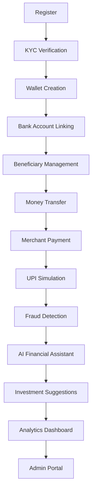

Every feature builds upon another to simulate a complete digital payment ecosystem.

---

# 🎯 Project Goals

The objective is not simply to learn Spring Boot.

The objective is to understand how modern backend systems actually work.

By the end of this project you will understand how a request travels through:

Browser

↓

API Gateway

↓

Microservices

↓

Redis Cache

↓

Kafka

↓

PostgreSQL

↓

Observability

↓

AI Services

↓

Cloud Infrastructure

↓

Response

---

# 🌟 Core Features

## Identity

- User Registration
- Login
- JWT Authentication
- OAuth2 Authentication
- Role Based Authorization
- Session Management

---

## Customer Management

- Profile Management
- KYC Verification
- Document Upload
- Account Verification

---

## Wallet

- Wallet Creation
- Wallet Balance
- Credit Wallet
- Debit Wallet
- Wallet History

---

## Banking

- Link Bank Account
- Multiple Accounts
- Beneficiary Management
- Account Verification

---

## Payments

- Money Transfer
- Merchant Payments
- QR Payments
- UPI Simulation
- Scheduled Payments
- Payment History

---

## Transaction Processing

- Transaction Lifecycle
- Payment Authorization
- Settlement
- Refunds
- Reversals
- Retry Mechanism

---

## Fraud Detection

- Rule Engine
- Velocity Checks
- Suspicious Activity Detection
- Risk Scoring

---

## AI Features

- Financial Assistant
- Expense Summarization
- Budget Planning
- Fraud Explanation
- Transaction Insights
- Investment Suggestions
- Intelligent Search

---

## Analytics

- Revenue Dashboard
- Transaction Dashboard
- Customer Analytics
- Fraud Analytics
- Performance Dashboard

---

## Administration

- Customer Management
- Merchant Management
- Transaction Monitoring
- Audit Logs
- Feature Flags

---

# 🏗 High Level Architecture

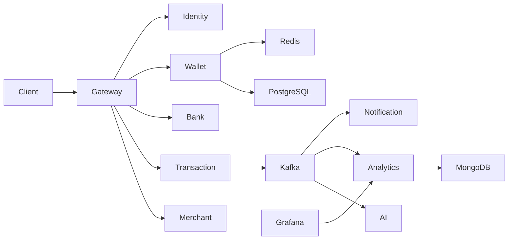

---

# ⚙ Technology Stack

| Layer | Technologies |
|----------|------------------------------|
| Language | Java 21 |
| Framework | Spring Boot 3 |
| Architecture | Microservices |
| API | REST + WebFlux |
| Security | Spring Security + JWT + OAuth2 |
| Database | PostgreSQL |
| Document Store | MongoDB |
| Cache | Redis |
| Event Streaming | Apache Kafka |
| Service Discovery | Eureka |
| API Gateway | Spring Cloud Gateway |
| Config | Spring Cloud Config |
| AI | Spring AI |
| AI Agents | LangChain4j |
| LLM | Ollama |
| Monitoring | Prometheus |
| Dashboards | Grafana |
| Tracing | OpenTelemetry |
| Containerization | Docker |
| Orchestration | Kubernetes |
| Build Tool | Maven |

---

# 💡 Why This Project?

Most tutorials teach technologies.

FinSphere teaches systems.

Instead of:

Learn Spring Boot

↓

Create CRUD

↓

Finish

FinSphere follows a production engineering mindset:

Need Authentication?

↓

Build Authentication.

↓

Debug Authentication.

↓

Observe Authentication.

↓

Scale Authentication.

↓

Understand Authentication Internals.

Every technology exists because the platform requires it—not because it is trendy.

---

# 🧠 Engineering Skills You'll Develop

✅ Enterprise Java

✅ Spring Boot

✅ Distributed Systems

✅ Event Driven Architecture

✅ API Design

✅ Domain Driven Design

✅ Authentication

✅ Authorization

✅ High Concurrency

✅ Reactive Programming

✅ JVM Internals

✅ Linux Fundamentals

✅ Docker

✅ Kubernetes

✅ Cloud Native Development

✅ AI Integration

✅ Observability

✅ Performance Tuning

✅ Production Debugging

✅ FinTech System Design

---

# 💳 FinTech Concepts

FinSphere is designed around real financial engineering principles.

- Wallet Architecture
- Double Entry Ledger
- Idempotent Transactions
- Merchant Payments
- Transaction Settlement
- Refund Processing
- Payment Reconciliation
- Fee Calculation
- Audit Trails
- Fraud Detection
- AML Concepts
- KYC Workflow
- Risk Scoring
- Multi Currency Support
- Exchange Rates
- Transaction Limits
- Account Freezing

---

# 🔄 Typical Request Lifecycle

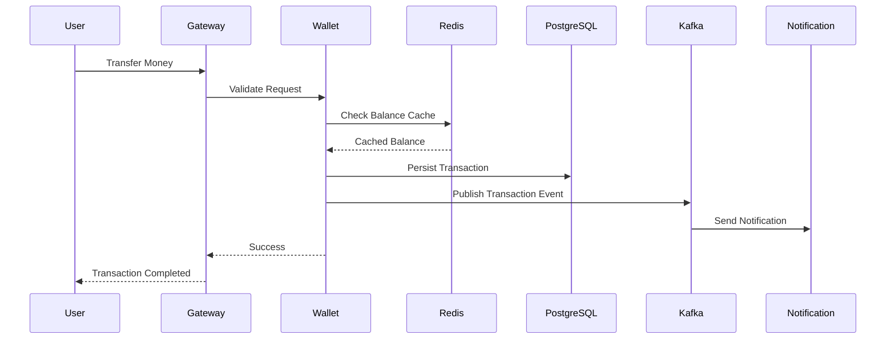

---

# 🚀 Project Philosophy

Don't memorize frameworks.

Build systems.

Observe systems.

Break systems.

Debug systems.

Optimize systems.

Repeat.

That is how backend engineers learn.

---

---

# 📁 Repository Structure

FinSphere follows a production-inspired monorepository structure where every service is independently deployable while sharing common engineering standards.

```text
FinSphere/
│
├── .github/                         # GitHub workflows & templates
│   ├── ISSUE_TEMPLATE/
│   ├── workflows/
│   └── pull_request_template.md
│
├── docs/                            # Project documentation
│   ├── architecture/
│   ├── api/
│   ├── diagrams/
│   ├── deployment/
│   ├── learning/
│   ├── decisions/
│   ├── security/
│   └── troubleshooting/
│
├── services/
│   ├── identity-service/
│   ├── customer-service/
│   ├── wallet-service/
│   ├── bank-service/
│   ├── transaction-service/
│   ├── merchant-service/
│   ├── payment-service/
│   ├── notification-service/
│   ├── analytics-service/
│   ├── fraud-service/
│   ├── ai-service/
│   ├── admin-service/
│   └── gateway/
│
├── infrastructure/
│   ├── docker/
│   ├── kubernetes/
│   ├── helm/
│   ├── kafka/
│   ├── redis/
│   ├── postgres/
│   ├── mongodb/
│   ├── monitoring/
│   ├── tracing/
│   ├── ingress/
│   └── scripts/
│
├── shared/
│   ├── common-library/
│   ├── security-library/
│   ├── event-library/
│   ├── dto-library/
│   ├── exception-library/
│   └── utilities/
│
├── testing/
│   ├── integration/
│   ├── performance/
│   ├── load/
│   ├── security/
│   └── chaos/
│
├── postman/
├── scripts/
├── docker-compose.yml
├── pom.xml
├── README.md
└── LICENSE
```

---

# 🏗 Repository Philosophy

FinSphere is organized exactly like a production engineering repository.

Instead of putting everything inside one Spring Boot application, every business capability is isolated into an independent service.

Benefits include:

- Independent deployments
- Independent scaling
- Better ownership
- Easier maintenance
- Fault isolation
- Technology evolution
- Production-like architecture

---

# 🧩 Microservice Architecture

Each microservice owns a single business capability.

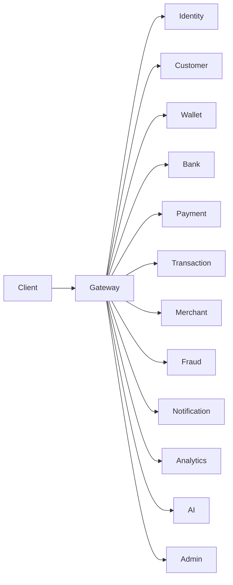

Every service communicates through REST APIs or asynchronous Kafka events depending on the business requirement.

---

# 🌐 API Gateway

The API Gateway is the single entry point into the platform.

Responsibilities:

- Authentication
- Authorization
- Request Routing
- Rate Limiting
- API Versioning
- Request Logging
- Load Balancing
- Circuit Breaking
- Cross-Origin Configuration
- Response Aggregation

```
Browser

↓

Gateway

↓

Business Services
```

No client communicates directly with internal services.

---

# 🔐 Identity Service

The Identity Service manages everything related to authentication and authorization.

## Responsibilities

- User Registration
- Login
- JWT Generation
- Refresh Tokens
- OAuth2 Login
- Password Encryption
- Email Verification
- Forgot Password
- Role Management
- Permission Management

### Owns

- Users
- Roles
- Permissions
- Sessions

### Database

PostgreSQL

### Technologies

- Spring Security
- JWT
- OAuth2
- BCrypt
- PostgreSQL

---

# 👤 Customer Service

Customer Service manages customer information after authentication.

## Responsibilities

- Customer Profile
- Address
- Contact Information
- Preferences
- KYC Status
- Documents
- Verification Status

Owns

- Customer Profile
- Customer Settings
- KYC Metadata

---

# 💰 Wallet Service

Wallet Service manages digital wallets.

Responsibilities

- Wallet Creation
- Wallet Balance
- Credit Wallet
- Debit Wallet
- Freeze Wallet
- Wallet History
- Balance Inquiry

Business Rules

- No Negative Balance
- Atomic Updates
- Optimistic Locking
- Cached Balance

Database

PostgreSQL

Cache

Redis

---

# 🏦 Bank Service

Responsible for connected bank accounts.

Capabilities

- Link Bank Account
- Verify Account
- Beneficiary Management
- Account Validation
- IFSC Verification
- Account Status

Stores

- Bank Accounts
- Beneficiaries

---

# 💳 Payment Service

Handles payment initiation.

Features

- Merchant Payments
- QR Payments
- UPI Simulation
- Wallet Payments
- Bank Transfers
- Payment Authorization

Payment service never directly updates balances.

It delegates transaction execution to Transaction Service.

---

# 💸 Transaction Service

The heart of the platform.

Responsibilities

- Money Transfer
- Debit
- Credit
- Settlement
- Refund
- Reversal
- Audit Events
- Ledger Entry

Business Guarantees

- Atomic Transactions
- Idempotency
- ACID
- Event Publishing

Publishes

```
Transaction Created

↓

Kafka

↓

Consumers
```

---

# 🛒 Merchant Service

Responsible for merchant onboarding and management.

Features

- Merchant Registration
- Merchant Verification
- QR Generation
- Settlement Account
- Merchant Dashboard
- Transaction Reports

Stores

- Merchant Profile
- Merchant Settings
- Settlement Information

---

# 🚨 Fraud Service

Continuously evaluates transaction risk.

Responsibilities

- Velocity Checks
- Large Transaction Detection
- Geo Location Validation
- Device Validation
- Risk Scoring
- Suspicious Activity Detection

Consumes

Kafka Events

Produces

Fraud Alerts

---

# 📨 Notification Service

Notification Service never receives direct API requests.

Everything comes through Kafka.

Supported Channels

- Email
- SMS
- Push Notification
- Web Notification

Events

```
Payment Completed

↓

Kafka

↓

Notification Service

↓

Email
```

---

# 📈 Analytics Service

Responsible for reporting and dashboards.

Features

- Transaction Analytics
- Customer Growth
- Revenue
- Merchant Analytics
- Fraud Analytics
- Performance Reports

Unlike transactional services, Analytics is optimized for reads rather than writes.

---

# 🤖 AI Service

The intelligence layer of FinSphere.

Capabilities

- Financial Assistant
- Spending Analysis
- Budget Planning
- Fraud Explanation
- Transaction Search
- Investment Suggestions
- Personalized Insights

Powered By

- Spring AI
- LangChain4j
- Ollama
- Vector Database

Unlike traditional services, AI combines structured data with Large Language Models.

---

# 🛠 Admin Service

Internal platform management.

Capabilities

- Customer Management
- Merchant Approval
- User Suspension
- Account Freeze
- Fraud Review
- Audit Logs
- Feature Flags
- Configuration Management

Only administrators can access this service.

---

# 🔄 Service Communication

FinSphere intentionally mixes synchronous and asynchronous communication.

## Synchronous

Used when an immediate response is required.

Examples

```
Gateway

↓

Wallet Service

↓

Balance

↓

Response
```

Suitable for

- Login
- Balance Check
- Profile
- Wallet Details

---

## Asynchronous

Used for background processing.

```
Transaction

↓

Kafka

↓

Notification

↓

Analytics

↓

Fraud

↓

Audit
```

Suitable for

- Notifications
- Analytics
- Logging
- Fraud Detection
- Reporting

This reduces coupling and improves scalability.

---

# 📦 Shared Libraries

Instead of duplicating code across services, common components are shared.

```text
shared/
│
├── common-library/
│   ├── constants/
│   ├── enums/
│   ├── annotations/
│   └── validation/
│
├── dto-library/
│   ├── request/
│   ├── response/
│   └── events/
│
├── security-library/
│   ├── jwt/
│   ├── filters/
│   └── authentication/
│
├── event-library/
│   ├── kafka/
│   ├── producers/
│   └── consumers/
│
├── exception-library/
│   ├── handlers/
│   ├── errors/
│   └── responses/
│
└── utilities/
    ├── mapper/
    ├── converter/
    ├── helpers/
    └── validators/
```

This ensures:

- Consistent DTOs
- Standardized Exceptions
- Reusable Security Components
- Shared Validation
- Reduced Boilerplate

---

# 🧠 Design Principles

FinSphere follows modern software engineering principles throughout the codebase.

- Single Responsibility Principle (SRP)
- Open/Closed Principle (OCP)
- Interface Segregation Principle (ISP)
- Dependency Inversion Principle (DIP)
- Domain-Driven Design (DDD)
- Clean Architecture
- Hexagonal Architecture (where applicable)
- Event-Driven Design
- API-First Development
- Twelve-Factor App Methodology

These principles help keep the platform modular, testable, scalable, and production-ready as it grows.

---

---

# 🏗️ Infrastructure Architecture

FinSphere is designed using a **cloud-native, production-inspired infrastructure** where every component has a single responsibility. The infrastructure emphasizes scalability, resilience, observability, and independent deployments.

## High-Level Infrastructure

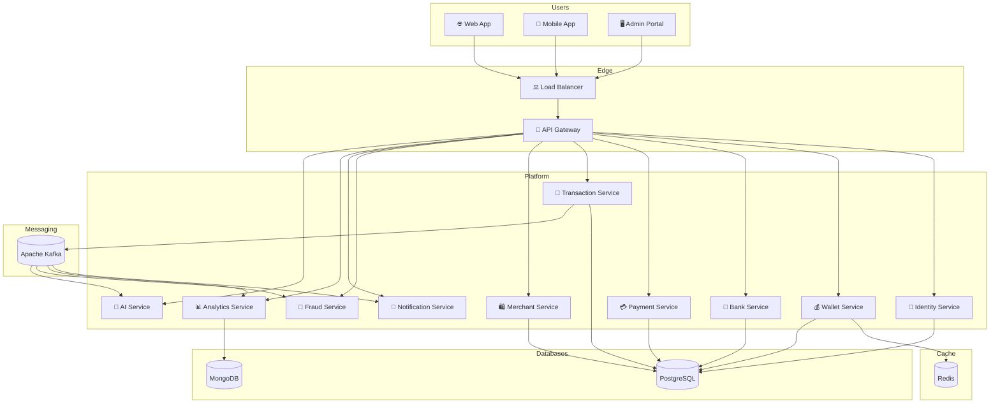

---

# ☁️ Cloud Native Principles

FinSphere follows modern cloud-native design patterns.

- Stateless Services
- Independent Deployments
- Externalized Configuration
- Event-Driven Communication
- Horizontal Scaling
- Health Monitoring
- Auto Recovery
- Immutable Infrastructure
- Containerized Workloads

Each service can be deployed, updated, and scaled without affecting the rest of the platform.

---

# 🐳 Docker

Every microservice is packaged as an independent Docker image.

## Why Docker?

- Consistent development environment
- Faster onboarding
- Reproducible deployments
- Platform independence
- Easy local testing
- CI/CD compatibility

---

## Container Layout

```text
+------------------------------------------------+
|                Docker Host                     |
|                                                |
|  API Gateway                                   |
|  Identity Service                              |
|  Wallet Service                                |
|  Transaction Service                           |
|  Merchant Service                              |
|  Notification Service                          |
|  Fraud Service                                 |
|  Analytics Service                             |
|  AI Service                                    |
|                                                |
|  PostgreSQL                                    |
|  MongoDB                                       |
|  Redis                                         |
|  Kafka                                         |
+------------------------------------------------+
```

---

## Local Development

```text
Git Clone

↓

Docker Compose

↓

Containers Start

↓

Platform Ready
```

---

# ☸️ Kubernetes

When running in production, Docker containers are orchestrated by Kubernetes.

## Kubernetes Responsibilities

- Container Scheduling
- Service Discovery
- Auto Healing
- Rolling Updates
- Auto Scaling
- Secrets Management
- Configuration Management
- Load Balancing

---

## Kubernetes Deployment

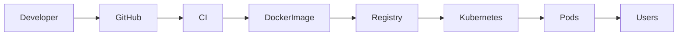

---

## Kubernetes Components

| Component | Purpose |
|-----------|----------|
| Pod | Runs application containers |
| Deployment | Maintains desired replicas |
| ReplicaSet | Ensures pod availability |
| Service | Internal networking |
| Ingress | External access |
| ConfigMap | Application configuration |
| Secret | Sensitive credentials |
| Horizontal Pod Autoscaler | Automatic scaling |

---

## Scaling Example

```text
Normal Traffic

Gateway

↓

Wallet Service (1 Pod)

↓

100 Requests

--------------------------------

Peak Traffic

Gateway

↓

Wallet Service

↓

Pod 1

Pod 2

Pod 3

Pod 4

↓

4000 Requests
```

No code changes are required.

---

# 🗄️ Data Storage Strategy

FinSphere uses **polyglot persistence**, choosing the best storage technology for each use case.

| Database | Purpose |
|-----------|----------|
| PostgreSQL | Transactional Data |
| MongoDB | Analytics & Documents |
| Redis | Caching |
| Kafka | Event Streaming |

Each technology solves a different problem.

---

# 🐘 PostgreSQL

PostgreSQL is the **primary transactional database**.

Used for:

- Users
- Wallets
- Accounts
- Transactions
- Merchants
- Payments
- Ledger
- KYC
- Beneficiaries

---

## Why PostgreSQL?

- ACID Compliance
- Strong Consistency
- Transactions
- Referential Integrity
- Mature Ecosystem
- High Reliability

Financial systems require strong consistency.

PostgreSQL provides that guarantee.

---

## Core Tables

```text
users

wallets

accounts

transactions

beneficiaries

payments

merchant_accounts

ledger_entries

audit_logs

kyc_documents
```

---

## Database Ownership

Every service owns its own schema.

```text
Identity

↓

identity_db

----------------

Wallet

↓

wallet_db

----------------

Transaction

↓

transaction_db

----------------

Merchant

↓

merchant_db
```

Services never directly query another service's database.

They communicate through APIs or Kafka events.

---

# 🍃 MongoDB

MongoDB stores flexible, document-oriented data.

Used for:

- Analytics
- AI Context
- Logs
- Audit Snapshots
- Search Indexes
- Reports

---

## Why MongoDB?

- Flexible Schema
- Fast Reads
- Large Documents
- Easy Aggregation
- JSON Native

Ideal for dashboards and reporting.

---

# ⚡ Redis

Redis acts as the in-memory performance layer.

---

## Cached Data

- Wallet Balance
- User Sessions
- JWT Blacklist
- OTP Codes
- Frequently Accessed Data
- Rate Limiting Counters

---

## Cache Flow

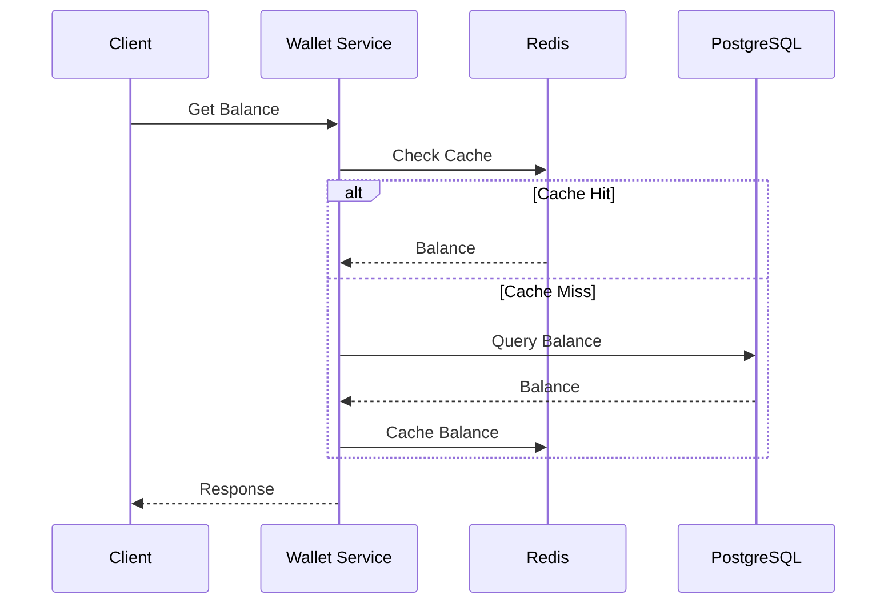

---

## Cache Strategy

FinSphere uses the **Cache-Aside Pattern**.

```text
Request

↓

Redis

↓

Cache Hit ?

↓

YES

↓

Return Data

----------------

NO

↓

Database

↓

Redis Update

↓

Return Data
```

---

## Redis Features

- TTL
- Expiration Policies
- Serialization
- Atomic Counters
- Distributed Locks
- Session Store

---

# 📡 Apache Kafka

Kafka powers asynchronous communication across the platform.

Instead of every service calling another synchronously, services publish events.

---

## Event Flow

```mermaid
flowchart LR

Transaction

↓

Kafka

↓

Notification

Analytics

Fraud

AI

Audit
```

---

## Example Transaction

```text
Money Transfer

↓

Transaction Service

↓

TransactionCompleted Event

↓

Kafka Topic

↓

Notification Service

↓

Email Sent

----------------

Analytics Updated

----------------

Fraud Engine Evaluated

----------------

AI Learns Spending Pattern
```

---

## Kafka Topics

```text
user.created

wallet.created

wallet.updated

transaction.created

transaction.completed

payment.authorized

payment.completed

merchant.created

notification.sent

fraud.detected

audit.logged
```

---

## Kafka Benefits

- Loose Coupling
- Scalability
- High Throughput
- Event Replay
- Fault Tolerance
- Independent Consumers

---

## Consumer Groups

```text
Transaction Event

↓

Kafka

↓

Consumer Group

├── Notification

├── Fraud

├── Analytics

└── AI
```

Each consumer processes the same event independently.

---

## Event-Driven Architecture

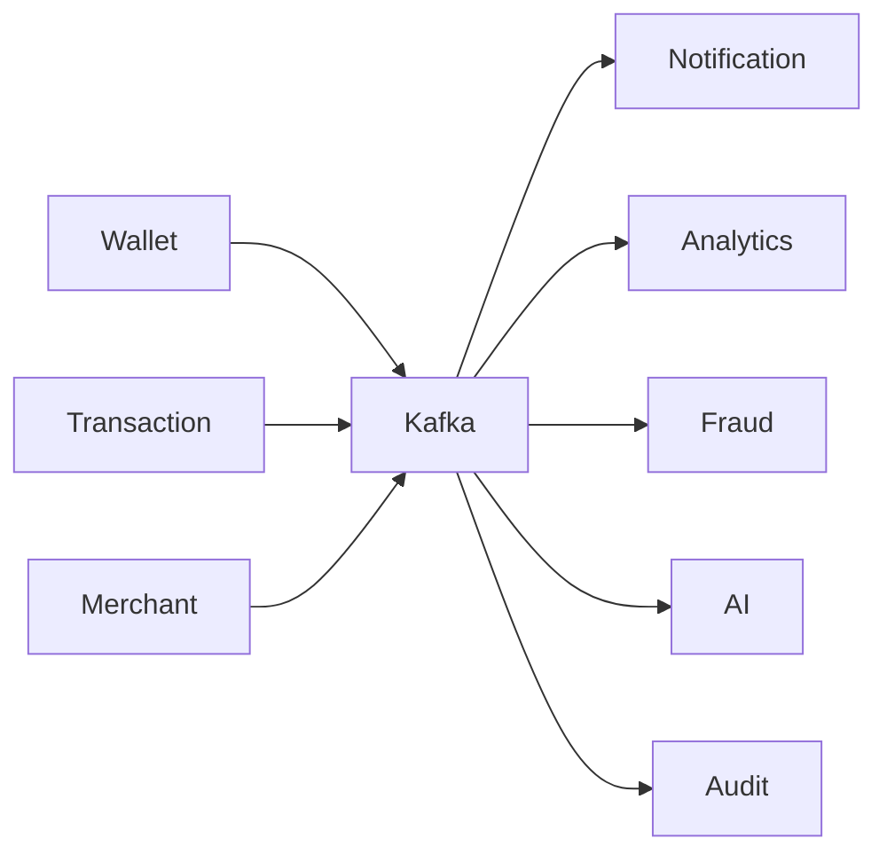

No service depends directly on another service's availability.

---

# 🔄 Data Consistency

Since services own their own databases, consistency is achieved through events.

```text
Transaction Completed

↓

Publish Event

↓

Other Services Update

↓

Eventually Consistent System
```

FinSphere embraces **eventual consistency** where appropriate while maintaining **strong consistency** for financial transactions.

---

# 📈 Performance Optimization

The infrastructure is designed to reduce latency and improve throughput.

### Database

- Connection Pooling
- Proper Indexing
- Query Optimization

### Redis

- Hot Data Caching
- Session Storage
- Fast Reads

### Kafka

- Asynchronous Processing
- Parallel Consumers
- Event Replay

### Kubernetes

- Horizontal Scaling
- Self Healing
- Rolling Updates

---

# 🧱 Infrastructure Principles

Every infrastructure decision follows a production engineering mindset.

- Container First
- API First
- Event First
- Database per Service
- Cache Before Database
- Async Where Possible
- Scale Horizontally
- Automate Deployments
- Monitor Everything
- Keep Services Loosely Coupled

These principles ensure that FinSphere evolves like a real-world fintech platform—capable of handling growth, failures, and continuous delivery while remaining maintainable and resilient.

---

---

# 🤖 Artificial Intelligence Architecture

FinSphere is more than a payment platform.

It includes an **AI-powered financial intelligence layer** that transforms raw financial data into meaningful insights, recommendations, and automated actions.

Unlike traditional chatbots, the AI layer can understand user context, retrieve financial information, execute backend tools, and provide personalized responses.

---

# 🎯 AI Vision

The goal is **not** to build another ChatGPT clone.

The goal is to build an intelligent financial assistant that understands:

- Customer Transactions
- Wallet Activity
- Spending Patterns
- Merchant History
- Financial Goals
- Investment Preferences
- Budget Planning
- Fraud Signals

Every AI response is grounded in the user's own financial data instead of generic internet knowledge.

---

# 🏗 AI Architecture

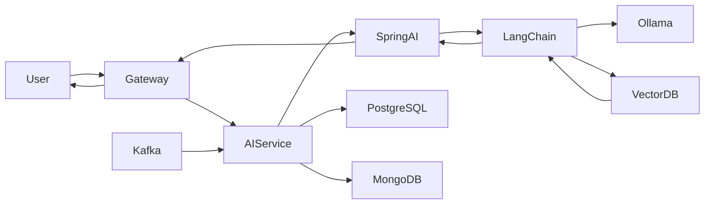

---

# 🧠 AI Responsibilities

The AI Service is responsible for:

- Financial Assistant
- Budget Planning
- Expense Analysis
- Spending Categorization
- Investment Suggestions
- Merchant Insights
- Fraud Explanation
- Intelligent Search
- Natural Language Queries
- AI-powered Customer Support

---

# 💬 Example Conversations

## Transaction Explanation

```
User

↓

Why did my wallet balance decrease?

↓

AI

↓

Search Transactions

↓

Analyze History

↓

Respond
```

---

## Budget Planning

```
User

↓

Can I save ₹10,000 this month?

↓

AI

↓

Analyze Income

↓

Analyze Expenses

↓

Generate Budget

↓

Return Recommendation
```

---

## Spending Analysis

```
User

↓

Where did I spend most last month?

↓

AI

↓

Query Database

↓

Aggregate Categories

↓

Generate Insights

↓

Display Summary
```

---

## Fraud Investigation

```
User

↓

Why was this payment flagged?

↓

AI

↓

Read Fraud Report

↓

Analyze Risk Score

↓

Explain Decision
```

---

# 🌱 Spring AI

Spring AI provides the abstraction layer between Spring Boot applications and Large Language Models.

Instead of calling model APIs directly, Spring AI offers consistent interfaces for prompts, models, embeddings, vector stores, and retrieval.

---

## Responsibilities

- Prompt Management
- Chat Models
- Embedding Models
- Vector Store Integration
- Structured Output
- AI Tool Integration
- Retrieval Augmented Generation (RAG)

---

## Why Spring AI?

- Native Spring Boot Integration
- Dependency Injection
- Model Abstraction
- Production Ready
- Easy Provider Switching
- Built-in Prompt Templates

---

## Spring AI Flow

```text
REST Request

↓

Spring Controller

↓

AI Service

↓

Spring AI

↓

LLM

↓

Response
```

---

# 🔗 LangChain4j

LangChain4j enables AI agents to interact with backend services instead of only generating text.

It provides:

- Tool Calling
- Memory
- Retrieval
- Agents
- Structured Prompts
- Function Execution

---

## Why LangChain4j?

Traditional LLMs generate answers.

LangChain4j enables LLMs to perform actions.

Examples include:

- Query databases
- Call Java services
- Search documents
- Execute business logic
- Chain multiple tools

---

## Agent Architecture

```mermaid
flowchart LR

Question

↓

Agent

↓

Planner

↓

Java Tool

↓

Database

↓

Planner

↓

LLM

↓

Answer
```

---

# 🛠 AI Tools

The AI Agent can call backend tools such as:

| Tool | Purpose |
|--------|----------|
| TransactionTool | Search Transactions |
| WalletTool | Balance Lookup |
| BudgetTool | Budget Analysis |
| MerchantTool | Merchant History |
| InvestmentTool | Portfolio Suggestions |
| FraudTool | Fraud Reports |
| KycTool | KYC Status |
| AnalyticsTool | Spending Reports |

The LLM decides when a tool is needed.

---

# 💻 Example Tool Flow

```
User

↓

How much did I spend on food?

↓

AI Agent

↓

TransactionTool

↓

Transaction Service

↓

PostgreSQL

↓

Grouped Result

↓

LLM

↓

Natural Language Response
```

---

# 🧩 AI Agent Workflow

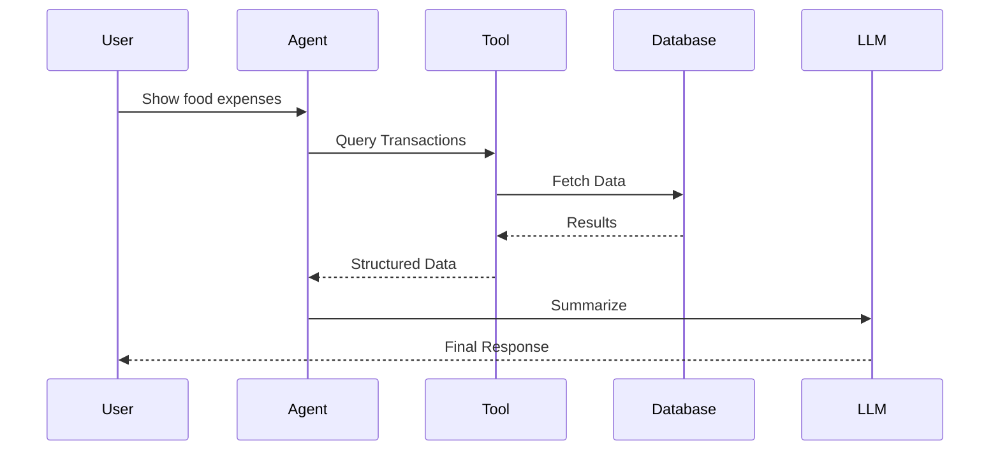

---

# 🦙 Ollama

FinSphere uses Ollama for local LLM inference during development.

This allows running open-source models without external APIs.

---

## Benefits

- Offline Development
- No API Cost
- Local Inference
- Faster Experimentation
- Better Privacy
- Easy Model Switching

---

## Example Models

- Llama 3
- Mistral
- Gemma
- Phi
- DeepSeek
- Qwen

The application should support switching models through configuration without code changes.

---

# 📚 Prompt Engineering

Prompts are treated as first-class application components.

Instead of embedding prompts directly in Java code, they are organized into reusable templates.

```text
prompts/

├── financial-advisor.st
├── expense-summary.st
├── fraud-analysis.st
├── investment-guide.st
├── budget-planner.st
├── merchant-analysis.st
└── transaction-explainer.st
```

---

## Prompt Categories

- Financial Advice
- Budget Planning
- Fraud Investigation
- Spending Insights
- Merchant Analysis
- Investment Guidance
- Customer Support

---

# 🧠 Memory Management

The AI remembers conversational context to provide more natural interactions.

Examples:

```
User

Show expenses.

↓

AI

Shows expenses.

↓

User

Only food.

↓

AI

Uses previous context.

↓

Returns filtered answer.
```

---

Memory Types

- Conversation Memory
- Session Memory
- User Context
- AI Preferences

---

# 🔍 Embeddings

Embeddings transform text into numerical vectors that capture semantic meaning.

They enable the system to search by meaning instead of exact keywords.

Examples:

```
Wallet Balance

↓

Embedding Model

↓

Vector

↓

Vector Database
```

---

Embeddings are generated for:

- KYC Policies
- Bank Policies
- FAQs
- Merchant Documentation
- Investment Guides
- Loan Information
- Tax Rules
- Financial Education Content

---

# 🗂 Vector Database

Traditional databases search exact values.

Vector databases search semantic meaning.

---

## Stores

- Policy Documents
- Product Manuals
- KYC Rules
- AML Documentation
- Financial Articles
- Banking FAQs
- Investment Knowledge
- AI Context

---

## Why Vector Search?

Traditional Search

```
"wallet"

↓

Exact Match
```

Vector Search

```
"How much money do I have?"

↓

Wallet Balance

↓

Relevant Result
```

The user does not need to know exact keywords.

---

# 🧩 Retrieval-Augmented Generation (RAG)

Instead of relying only on the LLM's built-in knowledge, FinSphere enriches prompts with relevant business documents and user-specific information.

---

## RAG Workflow

```mermaid
flowchart LR

Question

↓

Embedding

↓

Vector Search

↓

Relevant Documents

↓

Prompt Builder

↓

LLM

↓

Answer
```

---

## Example

```
User

↓

Explain KYC verification.

↓

Embedding

↓

Vector Database

↓

KYC Policy

↓

LLM

↓

Accurate Answer
```

The response is grounded in your own documentation rather than generic model knowledge.

---

# 📦 Knowledge Base

The vector store indexes internal knowledge sources such as:

```text
knowledge/

├── bank-policies/
├── kyc-guidelines/
├── aml-documents/
├── tax-rules/
├── merchant-guides/
├── investment-faq/
├── product-documentation/
└── support-articles/
```

---

# 🔄 AI Data Flow

```mermaid
flowchart TD

User

↓

Gateway

↓

AI Service

↓

Spring AI

↓

LangChain4j

↓

Need Data?

↓

Yes

↓

Java Tool

↓

Transaction Service

↓

PostgreSQL

↓

Result

↓

Prompt Builder

↓

LLM

↓

Response

↓

User
```

---

# 🎯 Future AI Enhancements

The AI layer is designed to evolve over time with more advanced capabilities.

Planned enhancements include:

- Voice Assistant
- Personalized Financial Coach
- AI Expense Categorization
- Smart Bill Reminders
- Savings Goal Tracking
- Loan Eligibility Estimation
- Portfolio Risk Analysis
- Receipt OCR
- Multi-language Conversations
- Autonomous Financial Agents
- MCP (Model Context Protocol) Integration
- Multi-model Routing
- AI Evaluation Pipelines
- Guardrails & Prompt Security
- Human-in-the-loop Review

---

# 🧠 AI Engineering Principles

The AI layer follows production-oriented design principles:

- AI augments business logic, not replaces it.
- Every answer should be explainable.
- Sensitive operations always require backend validation.
- Business rules remain deterministic; AI provides guidance.
- User data is never exposed beyond authorized boundaries.
- Retrieval is preferred over model memorization.
- Models should be replaceable without changing application code.
- AI components should be observable, testable, and versioned.

With this architecture, FinSphere evolves from a traditional payment platform into an intelligent financial platform capable of understanding user intent, retrieving enterprise knowledge, and assisting users through natural language while remaining grounded in real financial data.

---
# 🔐 Security Architecture

Security is a foundational principle of FinSphere.

Every request, service, event, and resource is protected using
modern enterprise security practices inspired by digital payment
platforms and banking systems.

---

# 🛡 Security Layers

```mermaid
flowchart TD

Client

↓

HTTPS

↓

Load Balancer

↓

API Gateway

↓

Authentication

↓

Authorization

↓

Rate Limiter

↓

Business Services

↓

Database
```

Every request passes through multiple security layers before reaching business logic.

---

# Authentication

FinSphere supports multiple authentication mechanisms.

| Method | Purpose |
|----------|----------|
| JWT | Stateless Authentication |
| OAuth2 | Social Login |
| Refresh Token | Long Sessions |
| API Keys | Internal Services |
| Service Tokens | Microservice Communication |

---

## Login Flow

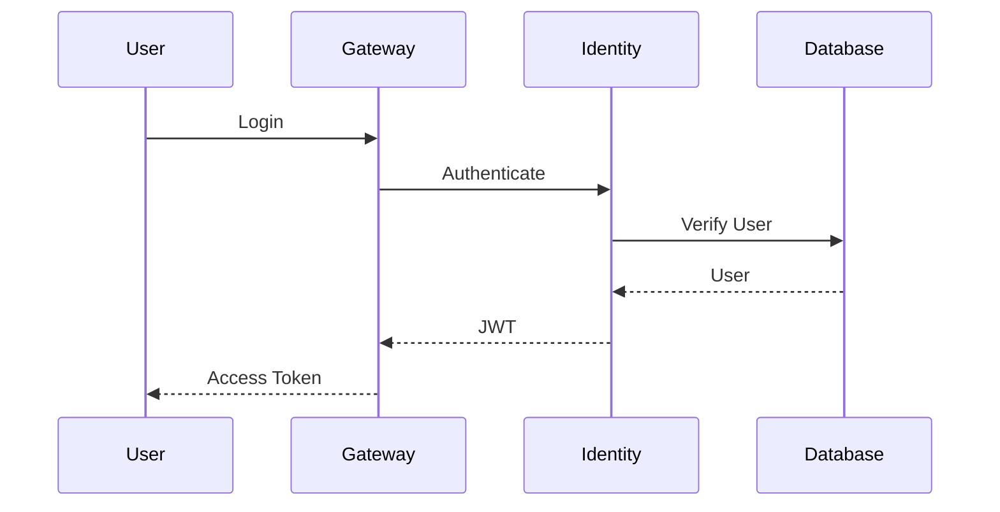

---

# Authorization

Every endpoint is protected using Role-Based Access Control (RBAC).

Example Roles

```text
CUSTOMER

MERCHANT

SUPPORT

ADMIN

SUPER_ADMIN

SYSTEM
```

---

Example Permissions

```text
wallet.read

wallet.write

transaction.create

transaction.read

merchant.manage

analytics.view

admin.users

admin.audit
```

---

# JWT Authentication

JWT Tokens contain

- User ID
- Username
- Roles
- Permissions
- Expiration
- Issuer

Example

```text
Authorization

↓

Bearer eyJhbGciOiJIUzI1Ni...
```

JWT keeps services stateless.

---

# Password Security

Passwords are never stored.

Stored values

```
Password

↓

BCrypt

↓

Hash

↓

Database
```

Security Features

- BCrypt
- Salt
- Strong Password Policy
- Password History
- Password Expiration

---

# HTTPS Everywhere

Every communication uses TLS.

```
Browser

↓

HTTPS

↓

Gateway

↓

HTTPS

↓

Microservices
```

No plain HTTP communication.

---

# API Gateway Security

Responsibilities

- JWT Validation
- Rate Limiting
- CORS
- Request Logging
- Request Filtering
- IP Restrictions
- API Versioning

---

# Secrets Management

Sensitive information is never committed.

Managed Secrets

- Database Passwords
- JWT Secret
- API Keys
- OAuth Credentials
- Kafka Credentials
- Redis Password
- Cloud Credentials

---

# Database Security

Security Practices

- Prepared Statements
- Parameterized Queries
- Least Privilege
- Encryption at Rest
- Audit Logging

No SQL is built using string concatenation.

---

# Service-to-Service Security

Microservices communicate securely.

```
Wallet

↓

Service Token

↓

Transaction

↓

Verified

↓

Response
```

---

# Fraud Protection

FinSphere includes multiple fraud prevention mechanisms.

Checks

- Velocity Rules
- Device Validation
- IP Validation
- Geo Validation
- Amount Limits
- Suspicious Merchant
- Impossible Travel
- Risk Score

---

# Audit Logging

Every sensitive action is logged.

Examples

- Login
- Password Change
- Money Transfer
- Merchant Approval
- Account Freeze
- Refund
- Role Change

---

# Security Headers

Gateway automatically applies

- HSTS
- CSP
- X-Frame-Options
- X-Content-Type-Options
- Referrer Policy

---

# Rate Limiting

Protects APIs against abuse.

```
Client

↓

API Gateway

↓

Rate Limiter

↓

Allowed?

↓

YES

↓

Service

----------------

NO

↓

429 Too Many Requests
```

---

# API Design Standards

FinSphere follows RESTful API design principles.

Example

```
GET     /api/v1/wallets

POST    /api/v1/payments

PUT     /api/v1/customers/{id}

DELETE  /api/v1/cards/{id}
```

---

# API Versioning

Every endpoint is versioned.

```
/api/v1/

/api/v2/

/api/v3/
```

Breaking changes never affect existing clients.

---

# Standard Response Format

```json
{
  "success": true,
  "timestamp": "2026-07-21T10:30:00Z",
  "data": {},
  "message": "Operation completed"
}
```

---

Error Response

```json
{
  "success": false,
  "error": {
    "code": "WALLET_NOT_FOUND",
    "message": "Wallet does not exist"
  }
}
```

---

# API Documentation

Every service exposes OpenAPI documentation.

```
Swagger UI

↓

Interactive Testing

↓

API Documentation

↓

OpenAPI Specification
```

---

# 📊 Observability

Modern engineering is not just about building software.

It is about understanding software while it is running.

FinSphere includes a complete observability stack.

---

# Observability Architecture

```mermaid
flowchart LR

Application

↓

Micrometer

↓

Prometheus

↓

Grafana

↓

Dashboards

Application

↓

OpenTelemetry

↓

Tempo

↓

Trace Viewer

Application

↓

Logs

↓

Loki

↓

Grafana
```

---

# Three Pillars

| Pillar | Technology |
|---------|------------|
| Metrics | Prometheus |
| Logs | Loki |
| Traces | OpenTelemetry |

---

# Metrics

Collected Metrics

- Request Count
- Error Rate
- Response Time
- JVM Heap
- CPU
- Memory
- Kafka Lag
- Redis Hits
- Database Connections

---

# Prometheus

Prometheus continuously scrapes application metrics.

```
Spring Boot

↓

Micrometer

↓

Prometheus

↓

Grafana
```

---

# Grafana

Dashboards include

- API Dashboard
- JVM Dashboard
- Kafka Dashboard
- Redis Dashboard
- PostgreSQL Dashboard
- Kubernetes Dashboard
- Business Dashboard

---

# Distributed Tracing

OpenTelemetry traces requests across microservices.

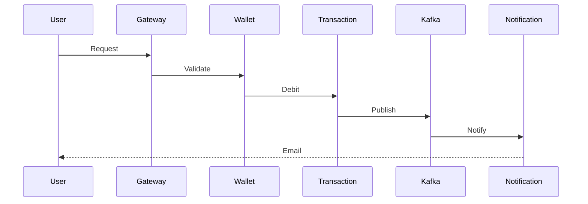

Every request has a Trace ID.

---

# Logging Strategy

Every service produces structured JSON logs.

Example

```json
{
  "traceId":"123abc",
  "service":"wallet-service",
  "level":"INFO",
  "message":"Wallet credited"
}
```

---

# Monitoring Dashboards

Engineering dashboards monitor

- API Performance
- Slow Queries
- Kafka Throughput
- Redis Cache Hit Ratio
- JVM Threads
- Heap Usage
- Container Health
- Pod Restarts
- Error Rate

Business dashboards monitor

- Daily Transactions
- Revenue
- Merchant Growth
- Active Users
- Fraud Rate
- Wallet Growth

---

# Health Checks

Every service exposes

```
/actuator/health

/actuator/info

/actuator/prometheus

/actuator/metrics
```

These endpoints enable Kubernetes and monitoring systems to detect failures automatically.

---

# Engineering Philosophy

FinSphere is designed to teach production engineering—not just framework usage.

Every feature should answer four questions:

### 1. What happens in my code?

- Which controller receives the request?
- Which service executes?
- Which repository is called?

### 2. What happens inside the JVM?

- Which objects are created?
- How are threads used?
- How does garbage collection behave?

### 3. What happens inside Linux?

- Which process owns the application?
- Which ports are open?
- Which sockets are active?

### 4. What happens in Kubernetes?

- Which Pod handled the request?
- Which Service routed traffic?
- Which Deployment created the Pod?

By repeatedly tracing requests across these four layers, you'll build the intuition required to design, debug, and operate real-world backend systems.

---

# 🎯 Final Goal

FinSphere is not intended to be another CRUD application.

It is a long-term engineering project that simulates how modern digital payment platforms are designed, built, secured, deployed, monitored, scaled, and enhanced with AI.

By completing this project, you'll gain practical experience across:

- Enterprise Java
- Spring Boot
- Spring Cloud
- Microservices
- PostgreSQL
- MongoDB
- Redis
- Kafka
- Docker
- Kubernetes
- Spring AI
- LangChain4j
- Ollama
- Observability
- Distributed Systems
- FinTech Engineering
- Production Debugging

The objective isn't just to learn frameworks.

The objective is to think, build, and operate systems like a backend engineer working on a modern fintech platform.

---

---

# 🚀 Getting Started

Welcome to **FinSphere**.

This guide will help you set up the complete development environment and run the platform locally.

Whether you're a beginner learning Spring Boot or an experienced backend engineer exploring distributed systems, the setup process is designed to be straightforward and reproducible.

---

# 📋 Prerequisites

Before running FinSphere, ensure the following tools are installed on your machine.

| Software | Version | Required |
|----------|----------|----------|
| Java | 21+ | ✅ |
| Maven | 3.9+ | ✅ |
| Docker | Latest | ✅ |
| Docker Compose | Latest | ✅ |
| Git | Latest | ✅ |
| IntelliJ IDEA / VS Code | Latest | Recommended |
| PostgreSQL | Docker | Included |
| Redis | Docker | Included |
| MongoDB | Docker | Included |
| Kafka | Docker | Included |
| Ollama | Latest | Optional (AI Features) |
| Kubernetes (Minikube/Kind/Docker Desktop) | Latest | Optional |

---

# 💻 Recommended Development Machine

Minimum

- 8 GB RAM
- 4 CPU Cores
- 25 GB Free Storage

Recommended

- 16 GB RAM
- 8 CPU Cores
- SSD Storage
- Docker Desktop
- IntelliJ IDEA Ultimate

AI Development

- 32 GB RAM (recommended)
- GPU (optional)
- Ollama installed locally

---

# 📦 Clone Repository

```bash
git clone https://github.com/<your-username>/FinSphere.git

cd FinSphere
```

---

# 📁 Project Structure

```text
FinSphere/

├── services/
├── infrastructure/
├── shared/
├── docs/
├── scripts/
├── docker-compose.yml
├── pom.xml
└── README.md
```

---

# ⚙ Local Development Architecture

```mermaid
flowchart LR

Developer

↓

IDE

↓

Spring Boot Services

↓

Docker Containers

↓

PostgreSQL

Redis

MongoDB

Kafka

↓

Application Ready
```

---

# 🐳 Running with Docker Compose

Docker Compose starts the required infrastructure for local development.

Services Included

- PostgreSQL
- MongoDB
- Redis
- Kafka
- Zookeeper
- Prometheus
- Grafana
- Zipkin (optional)
- PgAdmin (optional)
- Redis Insight (optional)

---

## Start Infrastructure

```bash
docker compose up -d
```

Verify running containers

```bash
docker ps
```

Expected output

```text
postgres

redis

mongodb

kafka

zookeeper

grafana

prometheus
```

---

## Stop Infrastructure

```bash
docker compose down
```

---

## Remove Volumes

```bash
docker compose down -v
```

---

## Restart Everything

```bash
docker compose restart
```

---

# 📊 Infrastructure Ports

| Service | Port |
|----------|------|
| API Gateway | 8080 |
| Identity Service | 8081 |
| Wallet Service | 8082 |
| Transaction Service | 8083 |
| Merchant Service | 8084 |
| Analytics Service | 8085 |
| AI Service | 8086 |
| PostgreSQL | 5432 |
| MongoDB | 27017 |
| Redis | 6379 |
| Kafka | 9092 |
| Prometheus | 9090 |
| Grafana | 3000 |
| Zipkin | 9411 |

---

# 🐘 PostgreSQL

Default credentials

```text
Host

localhost

Port

5432

Database

finsphere

Username

postgres

Password

postgres
```

---

# ⚡ Redis

```text
Host

localhost

Port

6379
```

---

# 🍃 MongoDB

```text
Host

localhost

Port

27017
```

---

# 📡 Kafka

```text
Bootstrap Server

localhost:9092
```

---

# 🤖 Ollama

Install Ollama

```bash
ollama pull llama3
```

Verify

```bash
ollama list
```

Run

```bash
ollama serve
```

Default URL

```text
http://localhost:11434
```

---

# 📂 Environment Variables

FinSphere uses environment variables for configuration.

Example

```bash
SPRING_PROFILES_ACTIVE=local

SERVER_PORT=8080

JWT_SECRET=change-me

JWT_EXPIRATION=86400

POSTGRES_HOST=localhost

POSTGRES_PORT=5432

POSTGRES_DB=finsphere

POSTGRES_USER=postgres

POSTGRES_PASSWORD=postgres

REDIS_HOST=localhost

REDIS_PORT=6379

MONGODB_URI=mongodb://localhost:27017/finsphere

KAFKA_BOOTSTRAP_SERVERS=localhost:9092

OLLAMA_BASE_URL=http://localhost:11434

SPRING_AI_MODEL=llama3
```

---

# 📄 Example .env

```env
SPRING_PROFILES_ACTIVE=local

JWT_SECRET=my-super-secret-key

POSTGRES_HOST=localhost
POSTGRES_PORT=5432
POSTGRES_DB=finsphere
POSTGRES_USER=postgres
POSTGRES_PASSWORD=postgres

REDIS_HOST=localhost
REDIS_PORT=6379

MONGODB_URI=mongodb://localhost:27017/finsphere

KAFKA_BOOTSTRAP_SERVERS=localhost:9092

OLLAMA_BASE_URL=http://localhost:11434

SPRING_AI_MODEL=llama3
```

---

# ▶ Running Individual Services

Example

Identity Service

```bash
cd services/identity-service

mvn spring-boot:run
```

Wallet Service

```bash
cd services/wallet-service

mvn spring-boot:run
```

Transaction Service

```bash
cd services/transaction-service

mvn spring-boot:run
```

Repeat for the remaining services.

---

# 🏃 Running the Entire Platform

Future versions will include helper scripts.

Linux / macOS

```bash
./scripts/start-all.sh
```

Windows

```powershell
scripts\start-all.ps1
```

Expected Flow

```text
Start Infrastructure

↓

Start Gateway

↓

Start Identity Service

↓

Start Wallet Service

↓

Start Transaction Service

↓

Start Merchant Service

↓

Start Remaining Services

↓

Platform Ready
```

---

# 🌐 Access the Platform

| Component | URL |
|-----------|-----|
| API Gateway | http://localhost:8080 |
| Swagger UI | http://localhost:8080/swagger-ui.html |
| Grafana | http://localhost:3000 |
| Prometheus | http://localhost:9090 |
| Zipkin | http://localhost:9411 |

---

# 📚 Development Workflow

Every feature should follow the same engineering cycle.

```text
Understand Requirement

↓

Design

↓

Implement

↓

Test

↓

Debug

↓

Observe

↓

Optimize

↓

Document

↓

Commit

↓

Repeat
```

---

# 🌿 Git Workflow

Create a feature branch

```bash
git checkout -b feature/wallet-service
```

Commit changes

```bash
git add .

git commit -m "feat(wallet): implement wallet creation"
```

Push branch

```bash
git push origin feature/wallet-service
```

Open a Pull Request.

---

# 📝 Coding Standards

- Follow Java 21 best practices.
- Use constructor injection.
- Prefer records for DTOs where appropriate.
- Keep controllers thin.
- Put business logic in services.
- Validate all inputs.
- Write meaningful commit messages.
- Add unit tests for business logic.
- Use descriptive method and class names.
- Document public APIs with OpenAPI annotations.

---

# 🧹 Code Formatting

Recommended tools

- Spotless
- Checkstyle
- EditorConfig
- SonarLint

Run formatting

```bash
mvn spotless:apply
```

---

# 🔍 Troubleshooting

### Docker containers not starting

```bash
docker compose logs
```

### Check running containers

```bash
docker ps
```

### Check service logs

```bash
docker logs <container-name>
```

### Verify Kafka

```bash
docker exec -it kafka kafka-topics --list --bootstrap-server localhost:9092
```

### Verify PostgreSQL

```bash
docker exec -it postgres psql -U postgres
```

### Verify Redis

```bash
docker exec -it redis redis-cli
```

---

# 🎯 What's Next?

Once your local environment is running successfully, you're ready to:

- Build your first microservice
- Connect PostgreSQL
- Publish Kafka events
- Cache with Redis
- Integrate Spring AI
- Deploy with Docker
- Scale with Kubernetes
- Observe with Grafana
- Secure with Spring Security
- Evolve FinSphere into a production-inspired fintech platform

---

---

# 🧪 Testing Strategy

FinSphere follows a **testing pyramid** to ensure reliability, maintainability, and confidence in every release.

```text
                ┌──────────────────────┐
                │     E2E Testing      │
                └──────────────────────┘
            ┌────────────────────────────┐
            │    Integration Testing     │
            └────────────────────────────┘
        ┌────────────────────────────────────┐
        │         Unit Testing               │
        └────────────────────────────────────┘
```

The majority of tests should be **fast unit tests**, followed by integration tests, with a smaller number of end-to-end tests validating complete user journeys.

---

# ✅ Unit Testing

Every business service should include comprehensive unit tests.

### Recommended Tools

| Tool | Purpose |
|-------|----------|
| JUnit 5 | Test Framework |
| Mockito | Mocking |
| AssertJ | Fluent Assertions |
| Spring Boot Test | Spring Testing Support |

Test examples:

- Wallet Creation
- Balance Validation
- Payment Authorization
- Fraud Rules
- Budget Calculations
- AI Prompt Builders

---

# 🔗 Integration Testing

Integration tests verify interactions between multiple components.

Examples include:

- Service ↔ PostgreSQL
- Service ↔ Redis
- Service ↔ Kafka
- Service ↔ MongoDB
- Service ↔ External APIs

Recommended libraries:

- Testcontainers
- Spring Boot Test
- WireMock

---

# 🚀 End-to-End Testing

End-to-end tests validate complete business workflows.

Example scenarios:

```text
User Registration

↓

KYC Verification

↓

Wallet Creation

↓

Bank Account Linking

↓

Money Transfer

↓

Notification

↓

Analytics Updated
```

Additional scenarios:

- Merchant Payment
- Refund Processing
- Wallet Top-up
- AI Assistant Queries
- Fraud Detection

---

# 📊 Code Coverage

Target coverage goals:

| Layer | Target |
|--------|---------|
| Domain Services | 90%+ |
| Utility Classes | 90%+ |
| Controllers | 80%+ |
| Integration Tests | Critical Flows |
| End-to-End Tests | Major User Journeys |

Coverage should be treated as a quality indicator—not the sole measure of software quality.

---

# 🔄 Continuous Integration & Continuous Deployment (CI/CD)

FinSphere embraces automated delivery pipelines.

```mermaid
flowchart LR

Developer

↓

Git Commit

↓

GitHub

↓

GitHub Actions

↓

Build

↓

Unit Tests

↓

Integration Tests

↓

Docker Image

↓

Container Registry

↓

Deploy

↓

Kubernetes
```

---

# ⚙️ CI Pipeline

Every Pull Request should trigger:

- Code Compilation
- Static Analysis
- Unit Tests
- Integration Tests
- Code Formatting Validation
- Dependency Checks
- Docker Image Build

---

# 🚀 CD Pipeline

Every successful release can automatically:

- Publish Docker Images
- Tag Releases
- Deploy to Development
- Deploy to Staging
- Deploy to Production (Manual Approval)

---

# 🏷 Git Branch Strategy

```text
main

develop

feature/*

bugfix/*

hotfix/*

release/*
```

Branch purposes:

| Branch | Purpose |
|----------|----------|
| main | Production |
| develop | Active Development |
| feature/* | New Features |
| bugfix/* | Bug Fixes |
| release/* | Release Preparation |
| hotfix/* | Production Fixes |

---

# 🛣 Project Roadmap

The roadmap reflects the long-term vision for FinSphere.

## Phase 1 — Foundation

- [ ] Repository Setup
- [ ] Shared Libraries
- [ ] Identity Service
- [ ] API Gateway
- [ ] Configuration Server
- [ ] Service Discovery

---

## Phase 2 — Core Banking

- [ ] Customer Service
- [ ] Wallet Service
- [ ] Bank Account Service
- [ ] Beneficiary Management
- [ ] Ledger Design

---

## Phase 3 — Payments

- [ ] Money Transfers
- [ ] Merchant Payments
- [ ] QR Payments
- [ ] Payment Requests
- [ ] Refunds
- [ ] Scheduled Payments

---

## Phase 4 — Event-Driven Platform

- [ ] Kafka Integration
- [ ] Event Publishing
- [ ] Notification Service
- [ ] Audit Events
- [ ] Analytics Events

---

## Phase 5 — AI Platform

- [ ] Spring AI Integration
- [ ] LangChain4j
- [ ] Ollama Support
- [ ] Vector Database
- [ ] RAG Pipeline
- [ ] Financial Assistant

---

## Phase 6 — Observability

- [ ] Prometheus
- [ ] Grafana
- [ ] OpenTelemetry
- [ ] Centralized Logging
- [ ] Distributed Tracing

---

## Phase 7 — Cloud Native

- [ ] Docker Images
- [ ] Kubernetes
- [ ] Helm Charts
- [ ] Horizontal Scaling
- [ ] Auto Healing

---

## Phase 8 — Advanced Features

- [ ] Investment Module
- [ ] Loan Management
- [ ] Subscription Payments
- [ ] Multi-Currency Wallet
- [ ] AI Financial Coach
- [ ] Voice Assistant

---

# 🤝 Contributing

Contributions are welcome!

Whether you're fixing a typo, improving documentation, adding tests, or implementing a new feature, your contributions help improve the project.

## Development Workflow

1. Fork the repository.
2. Create a feature branch.
3. Make your changes.
4. Add or update tests.
5. Ensure formatting and linting pass.
6. Submit a Pull Request.

---

## Pull Request Checklist

- [ ] Code builds successfully.
- [ ] Tests pass.
- [ ] Documentation updated.
- [ ] No sensitive information committed.
- [ ] Follows project coding standards.

---

## Commit Message Convention

Follow the Conventional Commits specification.

Examples:

```text
feat(wallet): add wallet creation endpoint

fix(payment): resolve duplicate transaction issue

refactor(identity): simplify JWT validation

docs(readme): update architecture diagram

test(transaction): add integration tests
```

---

# 📜 License

This project is licensed under the **MIT License**.

You are free to:

- Use
- Modify
- Distribute
- Learn from
- Build upon

Please refer to the `LICENSE` file for the complete license text.

---

# 🙏 Acknowledgements

This project draws inspiration from modern engineering practices and the open-source ecosystem.

Special thanks to:

- Spring Ecosystem
- Java Community
- Apache Software Foundation
- Docker Community
- Kubernetes Community
- Grafana Labs
- PostgreSQL Community
- MongoDB Community
- Redis Community
- OpenTelemetry Contributors
- LangChain4j Contributors
- Spring AI Contributors

Their tools and documentation make projects like FinSphere possible.

---

# 📚 Learning Resources

The following technologies are valuable to study while building FinSphere:

## Backend Development

- Java 21
- Spring Boot
- Spring Security
- Spring Cloud
- Spring AI
- LangChain4j

## Databases

- PostgreSQL
- MongoDB
- Redis

## Messaging

- Apache Kafka

## Cloud Native

- Docker
- Kubernetes
- Helm

## Observability

- Prometheus
- Grafana
- OpenTelemetry

## Software Engineering

- Clean Architecture
- Domain-Driven Design (DDD)
- Event-Driven Architecture
- SOLID Principles
- Design Patterns
- Twelve-Factor App

---

# 🌟 Support the Project

If you find FinSphere useful:

- ⭐ Star the repository
- 🐛 Report issues
- 💡 Suggest new features
- 📖 Improve documentation
- 🤝 Contribute code
- 📢 Share the project with others

Your support helps the project grow and benefits the broader developer community.

---

# 🎯 Final Thoughts

FinSphere is not just a collection of microservices.

It is a hands-on engineering platform for learning how modern fintech systems are designed, built, secured, deployed, monitored, and enhanced with AI.

By working through this project, you'll gain experience with:

- Enterprise Java
- Distributed Systems
- Cloud-Native Development
- Event-Driven Architecture
- AI Integration
- Production Observability
- Secure API Design
- Modern DevOps Practices

The goal is not simply to build software—it is to understand the engineering principles behind scalable, resilient, and maintainable systems.

---

<div align="center">

## ⭐ If you found this project helpful, consider giving it a Star!

**Happy Coding! 🚀**

Made with ❤️ using Java, Spring Boot, and a passion for learning.

</div>

---

```
